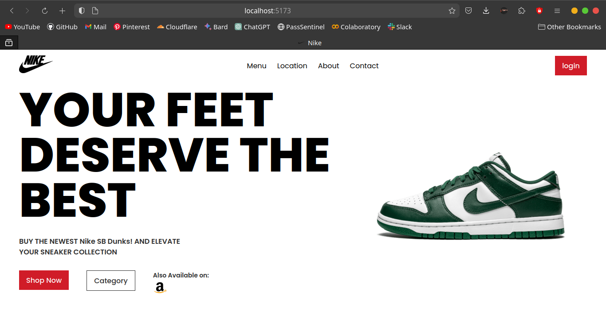

# Sneaker Webpage using React JS (Vite)

This project is a simple webpage showcasing a sneaker built using React JS with Vite. It demonstrates the basics of creating a responsive and dynamic webpage for showcasing a product.

### Screenshots

## Overview
Im learning frontend
so i made this webpage for an SB Dunk using react

## Installation
Provide steps on how to install and run the project locally. For example:
1. Clone the repository: `git clone https://github.com/comethrusws/sneaker-webpage.git`
2. Install dependencies: `npm install`
3. Start the development server: `npm run dev`

## Technologies Used
- React JS
- Vite
- Other dependencies...
